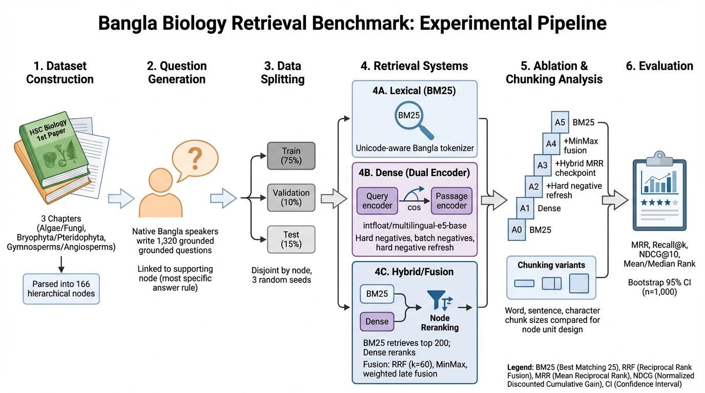

# A Controlled Study of Bangla Biology Textbook Retrieval

<p align="center">
  
  
  
  
  
</p>

This repository contains the code, preprocessing pipeline, benchmark assets, and evaluation scripts for the paper:

> **A Controlled Study of Bangla Biology Textbook Retrieval: Diagnosing Unit Design, Dense Supervision, and Hybrid Fusion**

The project studies **structure-aware retrieval for Bangla biology textbooks** and asks a focused question: how much retrieval quality depends on **retrieval-unit design**, **dense supervision**, and **sparse-dense hybrid fusion** in an educational setting.

Unlike open-domain retrieval, textbook evidence is organized by **chapter hierarchy, pedagogical boundaries, and curriculum structure**. This repository is designed as a **paper repo**: it reproduces the benchmark construction pipeline, the controlled ablation ladder, the chunking study, and the result aggregation used in the paper.

---

## Abstract

Reliable retrieval of textbook evidence is a core requirement for Bangla study assistants and teacher-support tools. We introduce a reproducible benchmark for structure-aware retrieval in Bangla textbooks, built from **3 biology chapters**, **166 hierarchy-derived nodes**, and **1,320 question-node pairs**, with **node-disjoint train/validation/test splits** across three seeds. Under a controlled evaluation protocol, we compare **BM25**, **multilingual-E5 dense retrieval**, **hard-negative refresh**, **sparse-dense fusion**, and **hierarchy-preserving versus flat chunk units**. The main findings are that **BM25 remains strong at early ranks**, **dense retrieval improves deeper recall**, and **hybrid fusion performs best overall**. The best reported system, **A5 with MinMax fusion**, reaches **0.7460 MRR** and **0.9233 Recall@20**.

---

## Experimental Pipeline

<p align="center">
  
</p>

The pipeline follows six stages: **dataset construction**, **question generation**, **data splitting**, **retrieval systems**, **ablation and chunking analysis**, and **evaluation**. The uploaded figure already matches the paper workflow and is ready to use in the repository.

---

## Benchmark Summary

- **Domain:** Bangla biology textbooks
- **Source book:** HSC Biology 1st Paper
- **Chapters:** 3
- **Retrieval nodes:** 166
- **Question-node pairs:** 1,320
- **Task:** single-positive retrieval
- **Split protocol:** node-disjoint train / validation / test
- **Split ratio:** 75% / 10% / 15%
- **Seeds:** 42, 43, 44
- **Metrics:** MRR, Recall@{1,3,5,10,20}, NDCG@10, mean rank, median rank

Covered chapters:

1. **Algae and Fungi**
2. **Bryophyta and Pteridophyta**
3. **Gymnosperms and Angiosperms**

Questions are manually authored in Bangla and linked to a gold supporting node using a **most-specific support** principle.

---

## Main Contributions of This Repository

- Reproducible **hierarchy-derived node construction** from textbook markdown
- **Unicode-aware BM25** retrieval over Bangla content
- **Dense bi-encoder retrieval** with `intfloat/multilingual-e5-base`
- **Hard-negative mining and refresh** during training
- **Hybrid reranking/fusion** with **RRF** and **MinMax**
- Controlled **A0–A5 ablation ladder**
- Flat **chunking baselines** for word, sentence, and character units
- Multi-seed result aggregation for paper-style reporting

---

## Controlled Ablation Ladder

The main paper experiments follow this progression:

- **A0** — BM25
- **A1** — Dense retrieval
- **A2** — A1 + hybrid fusion
- **A3** — A2 + hard-negative refresh
- **A4** — A3 + hybrid-MRR checkpoint selection
- **A5** — A3 + MinMax fusion

The paper reports that **A5** is the strongest configuration in the main ablation ladder.

### Main ablation takeaway

- **BM25** is a strong lexical anchor when retrieval units preserve textbook boundaries.
- **Dense retrieval** improves deeper recall but does not beat BM25 on early-rank precision by itself.
- **Hybrid fusion** provides the best overall balance for textbook-grounded Bangla retrieval.

---

## Best Reported Systems

| System | Family | MRR | R@1 | R@20 | NDCG@10 |
|---|---|---:|---:|---:|---:|
| BM25 (A0) | Sparse | 0.6545 | 0.5525 | 0.8831 | 0.6964 |
| C0-w128 DenseFT | Dense | 0.6801 | 0.5600 | 0.9334 | 0.7284 |
| A5 MinMax | Hybrid | **0.7460** | **0.6652** | 0.9233 | **0.7747** |

These are the strongest sparse, dense, and hybrid systems reported in the paper. The best hybrid model improves Recall@1 over BM25 by **+0.1127**, which the paper interprets as roughly **11 additional top-ranked supporting nodes per 100 learner questions**.

---

## Chunking Study

The repository also reproduces the chunking analysis comparing hierarchy-preserving nodes with flat chunk alternatives.

Supported chunk variants include:

- **Word chunks:** 128, 256, 512
- **Character chunks:** 500, 1000
- **Sentence chunks**

The main paper finding is that retrieval-unit effects are **model-dependent**:

- hierarchy-preserving units are strong for **BM25**
- dense retrieval is more sensitive to **chunk granularity** and **task-aligned supervision**
- the best flat dense system is **C0-w128 DenseFT**

---

## Repository Structure

```text
.
├── Processing/
│   ├── parse_md.py
│   ├── *.md
│   └── *.json
├── DatasetPrep/
│   ├── prepare_nodes.py
│   ├── qa_Gold.csv
│   ├── nodes.csv
│   └── nodes.jsonl
├── training/
│   ├── train_retriever.py
│   └── chunkingAb.py
└── results/
    ├── table.py
    ├── stat.json
    └── chunkingAb.json
```

### `Processing/`
Parses textbook markdown chapters into hierarchical JSON trees.

### `DatasetPrep/`
Builds the hierarchy-derived retrieval corpus used by the benchmark.

### `training/`
Contains the main ablation pipeline and chunking-study experiments.

### `results/`
Aggregates run outputs into paper-style summary tables.

---

## Setup

Use **Python 3.10+**.

### Create and activate a virtual environment

```powershell
python -m venv .venv
.\.venv\Scripts\Activate.ps1
python -m pip install --upgrade pip
```

### Install dependencies

```powershell
pip install -r DatasetPrep\requirements.txt
pip install -r training\requirements.txt
```

---

## Data Preparation

### 1. Parse textbook markdown into hierarchical JSON

```powershell
python Processing\parse_md.py Processing\BrTr.md --json-out Processing\BrTr.json
python Processing\parse_md.py Processing\AlFng.md --json-out Processing\AlFng.json
python Processing\parse_md.py Processing\GymAng.md --json-out Processing\GymAng.json
```

### 2. Build hierarchy-derived retrieval nodes

```powershell
python DatasetPrep\prepare_nodes.py
```

This step generates:

- `DatasetPrep/nodes.csv`
- `DatasetPrep/nodes.jsonl`

Expected fields in `nodes.csv`:

- `node_id`
- `chapter_id`
- `source_file`
- `level`
- `heading`
- `heading_path`
- `content`

---

## Running the Main Experiments

From the repository root:

```powershell
python training\train_retriever.py
```

This script runs the controlled **A0–A5** benchmark using the project-relative defaults already described in the codebase.

### What it does

- builds node-disjoint splits
- trains dense bi-encoder variants
- evaluates BM25, dense, and hybrid systems
- saves per-run outputs
- writes a global summary to `results/stat.json`

---

## Running the Chunking Study

```powershell
python training\chunkingAb.py
```

Outputs include:

- `chunk_baseline_results_<timestamp>.json`
- `chunk_baseline_summary_<timestamp>.txt`
- `results/chunkingAb.json`

This script compares hierarchy-preserving nodes against flat chunk alternatives under:

- **BM25**
- **DenseZS**
- **DenseFT**

---

## Generating Paper Tables

```powershell
python results\table.py
```

This reads:

- `results/stat.json`
- `results/chunkingAb.json`

and prints formatted comparison tables suitable for reporting and verification.

---

## Recommended Reproduction Order

1. Parse markdown chapters into JSON.
2. Build retrieval nodes with `DatasetPrep/prepare_nodes.py`.
3. Verify that `qa_Gold.csv` maps to valid node IDs in `nodes.csv`.
4. Run `training/train_retriever.py`.
5. Run `training/chunkingAb.py`.
6. Run `results/table.py`.

---

## Reproducibility Notes

For clean experimental reporting, keep track of:

- commit hash
- seed set
- config values
- generated summary JSON files
- printed comparison tables

Additional notes:

- GPU is recommended for dense training.
- CPU-only execution is possible but slower.
- `train_retriever.py` and `chunkingAb.py` execute immediately because they call `run()` at file end.
- `train_retriever.py` checks whether all gold node IDs exist in `nodes.csv`.
- `prepare_nodes.py` preserves deterministic chapter processing order.

---

## Limitations

This benchmark is intentionally compact and should be read as a **controlled educational retrieval benchmark**, not a large-scale production retrieval benchmark. The paper explicitly notes that the corpus size is small and that hybrid evaluation in this setting is close to **near-exhaustive reranking** rather than scalable first-stage retrieval.

---

## Citation

If you use this repository, please cite the accompanying paper.

```bibtex
@misc{anonymous2026banglabiologyretrieval,
  title        = {A Controlled Study of Bangla Biology Textbook Retrieval: Diagnosing Unit Design, Dense Supervision, and Hybrid Fusion},
  author       = {Anonymous ACL Submission},
  year         = {2026},
  note         = {Update citation after review}
}
```

---

## Review Anonymity

If the paper is still under double-blind review, avoid adding author names, affiliations, lab names, institution-specific links, or identifying acknowledgments until the review period is over.
